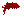
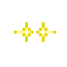
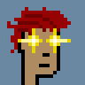
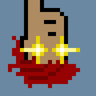
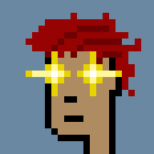

#  The Making of Adam (24x24 Pixel Punk) from Scratch / Zero Using Pixel Art Designs in the ASCII Text Format


## Step 1 - Generate 24x24 Attributes From Pixel Art (In ASCII Text Format)


Let's start with the (base) face:

``` ruby
require 'pixelart'

colors = {
  '.' => 0,           # color 0 - transparent
  '@' => '000000',    # color 1 - black
  'x' => '86581E',    # color 2 - rgb(134  88  30) - hsl( 33°  63%  32%)
  'o' => 'A77C47',    # color 3 - rgb(167 124  71) - hsl( 33°  40%  47%)
  '^' => 'AE8B61',    # color 4 - rgb(174 139  97) - hsl( 33°  32%  53%)
  '~' => 'B69F82',    # color 5 - rgb(182 159 130) - hsl( 33°  26%  61%)
}

img = Image.parse( <<TXT, colors: colors )
. . . . . . . . . . . . . . . . . . . . . . . .
. . . . . . . . . . . . . . . . . . . . . . . .
. . . . . . . . . . . . . . . . . . . . . . . .
. . . . . . . . . . . . . . . . . . . . . . . .
. . . . . . . . . . . . . . . . . . . . . . . .
. . . . . . . . @ @ @ @ @ @ @ . . . . . . . . .
. . . . . . . @ ^ ^ ^ ^ ^ ^ ^ @ . . . . . . . .
. . . . . . @ ^ ^ ~ ^ ^ ^ ^ ^ ^ @ . . . . . . .
. . . . . . @ ^ ~ ^ ^ ^ ^ ^ ^ ^ @ . . . . . . .
. . . . . . @ ^ ^ ^ ^ ^ ^ ^ ^ ^ @ . . . . . . .
. . . . . . @ ^ ^ ^ ^ ^ ^ ^ ^ ^ @ . . . . . . .
. . . . . . @ ^ ^ x x ^ ^ ^ x x @ . . . . . . .
. . . . . @ ^ ^ ^ @ o ^ ^ ^ @ o @ . . . . . . .
. . . . . @ ^ ^ ^ ^ ^ ^ ^ ^ ^ ^ @ . . . . . . .
. . . . . @ @ ^ ^ ^ ^ ^ ^ ^ ^ ^ @ . . . . . . .
. . . . . . @ ^ ^ ^ ^ ^ @ @ ^ ^ @ . . . . . . .
. . . . . . @ ^ ^ ^ ^ ^ ^ ^ ^ ^ @ . . . . . . .
. . . . . . @ ^ ^ ^ ^ ^ ^ ^ ^ ^ @ . . . . . . .
. . . . . . @ ^ ^ ^ ^ @ @ @ ^ ^ @ . . . . . . .
. . . . . . @ ^ ^ ^ ^ ^ ^ ^ ^ ^ @ . . . . . . .
. . . . . . @ ^ ^ ^ ^ ^ ^ ^ ^ @ . . . . . . . .
. . . . . . @ ^ ^ ^ @ @ @ @ @ . . . . . . . . .
. . . . . . @ ^ ^ ^ @ . . . . . . . . . . . . .
. . . . . . @ ^ ^ ^ @ . . . . . . . . . . . . .
TXT

img.save( "./i/attributes/face.png" )
img.zoom(4).save( "./i/attributes/face@4x.png" )
```

Voila!

 4x 


Let's add a hair-do attribute. Note: Let's place
all attributes in a 24x24 canvas (for easier image composition):

``` ruby
colors = {
  '.' => 0,          # color 0
  '@' => '970202',   # color 1
  'x' => '6E0202',   # color 2
}

hair = Image.parse( <<TXT, colors: colors )
. . . . . @ . . . . @ . . . . . . .
. . . . @ @ @ @ @ @ @ @ @ @ @ . . .
. . . . @ x x x x x @ @ @ @ @ @ . .
. . @ @ @ @ @ @ @ @ x x @ @ @ @ @ .
@ . . x x x x x x @ @ @ x @ @ @ @ @
@ @ @ @ @ @ @ @ @ x @ @ @ x @ @ @ .
. . @ x x x @ @ . . x . @ . x . . .
. . @ @ . . x . . . . . . . . . . .
. @ @ @ . . . . . . . . . . . . . .
. @ @ . . . . . . . . . . . . . . .
. . @ . . . . . . . . . . . . . . .
. . @ . . . . . . . . . . . . . . .
. @ . . . . . . . . . . . . . . . .
TXT
img = Image.new( 24, 24 )
img.compose!( hair, 2, 2 )   # place in 24x24 canvas (image) with x/y offset

img.save( "./i/attributes/hair.png")
img.zoom(4).save( "./i/attributes/hair@4x.png")
```

Voila!

 4x 


Let's add a laser eyes attribute:

``` ruby
colors = {
  '.' =>  0,         # color 0
  '@' => 'E6D300',   # color 1
  'x' => 'FFF799',   # color 2
  'o' => 'FFFFFF',   # color 3
}

lasereyes = Image.parse( <<TXT, colors: colors )
. . . . @ . . . . . @ . . . .
. . . . @ . . . . . @ . . . .
. . . @ x @ . . . @ x @ . . .
@ x x x o x @ . @ x o x x x @
. . . @ x @ . . . @ x @ . . .
. . . . @ . . . . . @ . . . .
. . . . @ . . . . . @ . . . .
TXT
img = Image.new( 24, 24 )
img.compose!( lasereyes, 5, 8 )   # place in 24x24 canvas (image) with x/y offset

img.save( "./i/attributes/lasereyes.png")
img.zoom(4).save( "./i/attributes/lasereyes@4x.png")
```

Voila!

 4x 


## Step 2 - All-Together Now - Generate 24x24 Pixel Punk From Attributes


Let's put together Adam on a blue-ish backgorund (`6A88A1`):


``` ruby
punk = Image.new( 24, 24, '6A88A1' )   # canvas (image) with background color
punk.compose!( Image.read( "i/attributes/face.png" ))
punk.compose!( Image.read( "i/attributes/hair.png" ))
punk.compose!( Image.read( "i/attributes/lasereyes.png" ))

punk.save( "./i/adam.png" )
punk.zoom(4).save( "i/adam@4x.png")
punk.zoom(8).save( "i/adam@8x.png")
```

Voila!


4x 
8x 


Bonus - Try some variants - flip (horizontally):

``` ruby
punk.flip.save( "./i/adam_flipped.png" )  ## flip horizontally
punk.flip.zoom(4).save( "i/adam_flipped@4x.png")
punk.flip.zoom(8).save( "i/adam_flipped@8x.png")
```

Voila!


4x 
8x 


Or left is the new right:

``` ruby
punk.mirror.save( "./i/adam_left.png" )
punk.mirror.zoom(4).save( "i/adam_left@4x.png")
punk.mirror.zoom(8).save( "i/adam_left@8x.png")
```


4x 
8x 


That's it. Now create your own Adam (or Eve). Yes, you can.


## Questions? Comments?

Post them on the [CryptoPunksDev reddit](https://old.reddit.com/r/CryptoPunksDev). Thanks.


