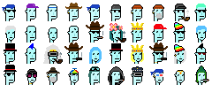
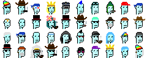
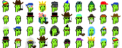

# New All Star Cool Blue Alien Experiment - 40 Extraterrestrial Humanoid Andorians - Native to the Blue Icy Class M Moon Andoria  ++ Plus Bonus - How About Cyber Green? Burning Red?


Here's the experiment - let's unite all aliens from all collections (9 in original, 21 in more, 10 in expansion) into a new
all star blue alien series.


Let's start collecting all aliens from the universe:


``` ruby
require 'cryptopunks'

aliens = []    # collections of all aliens

punks = Punks::Image::Composite.read( '../programming-cryptopunks/punks.png' )

# 9 aliens (male) in original series
ids_original = [635, 2890, 3100, 3443, 5822, 5905, 6089, 7523, 7804]
ids_original.each do |id|
  punk = punks[id]
  aliens << punk
end
```

and continue with the more series:


``` ruby
punks = Punks::Image::Composite.read( '../programming-cryptopunks/i/morepunks.png' )

# 21 aliens (male/female) in more series
ids_more = [
0, 100, 210, 300, 399, 440, 500, 599, 640, 700, 719, 790,
810, 869, 900, 959, 971, 977, 982, 986, 993]

ids_more.each do |id|
  punk = punks[id]
  aliens << punk
end
```

and wrap up with the expansion series:

``` ruby
punks = Punks::Image::Composite.read( '../programming-cryptopunks/i/expansionpunks.png' )

# 10 aliens (male/female) in expansion series
ids_expansion = [741, 2428, 3638, 4267, 4722, 4926,
                 6693, 8029, 8124, 9171]
ids_expansion.each do |id|
  punk = punks[id]
  aliens << punk
end

puts "  #{aliens.size} alien(s)"
#=> 40 alien(s)
```


Now what? Let's put together a new super rare exclusive composite image (with a 10x4 grid):


``` ruby
# the linear version (9 original -> 21 more -> 10 expansion aliens)

img = ImageComposite.new( 10, 4 )
aliens.each do |alien|
  img << alien
end

img.save( "aliens.png" )
img.zoom(4).save("aliens4x.png")
```



4x: 


Let's randomize / reshuffle the series. Instead of 0,1,2,.. up to 39.
Let's try:

``` ruby
indexes = [18, 23, 37, 26, 36, 21, 34, 39, 17, 4,
           38, 12, 20, 15, 25, 14, 9, 32, 6, 3,
           10, 0, 11, 2, 35, 29, 8, 24, 33, 5,
           30, 7, 22, 27, 13, 31, 1, 16, 19, 28]

## note: loop use "randomized / reshuffled" indexes
img = ImageComposite.new( 10, 4 )
indexes.each do |i|
  img << aliens[i]
end

img.save( "aliens-randomized.png" )
img.zoom(4).save("aliens-randomized4x.png")
```

Voila!



4x: 


Are you a punk connoisseur?  Can you spot the million dollar aliens?
Can you spot the originals? Can you spot the cheapies?
Can you spot the unminted / yet unsold newcomers?


## Bonus - Let's try some different alien colors. Cyber green? Burning red?


Let's change the three alien base colors (
and let's turn up the saturation by 13%
and the lightness down by 30%)  using the hsl (hue, saturation, lightness)
color scheme / wheel:


``` ruby
hues = { green: 90,
         red:    0 }

saturation =  0.13
lightness  = -0.30

hues.each do |hue_name, hue|

  base    = [hue, 0.86+saturation, 0.88+lightness]
  darker  = [hue, 0.52+saturation, 0.74+lightness]
  darkest = [hue, 0.35+saturation, 0.60+lightness]

  color_map = {
      '#c8fbfbff' => base,
      '#9be0e0ff' => darker,
      '#75bdbdff' => darkest,
  }

  new_img = img.change_colors( color_map )
  new_img.save( "aliens_#{hue_name}.png" )
  new_img.zoom(4).save( "aliens_#{hue_name}4x.png" )
end
```

Voila!  In Green-ish



4x: 


In Red-ish


4x: 


That's it.  Now curate your own collection of collections. Yes, you can.

## Questions? Comments?

Post them on the [CryptoPunksDev reddit](https://old.reddit.com/r/CryptoPunksDev). Thanks.

