# Arabian Nights Experiment - Amazing Princesses with Middle-Eastern Headwear

Here's the experiment - let's use a middle-eastern headwear building block 
and let's turn zero-attribute "plain vanilla" punkette archetypes
into amazing looking princesses out of Arabian Nights.


Let's add the new hair building block  to the four archetypes -
human (with the four variants, that is, lighter, light, dark, darker)


,
 zombie 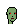,
 ape ,
 alien .


``` ruby
hair = Image.read( 'arab-hair.png' )

designs = [
  'human-female!lighter',
  'human-female!light',
  'human-female!dark',
  'human-female!darker',
  'zombie-female',
  'ape-female',
  'alien-female',
]


designs.each do |design|
  punk = Punks::Image.new( design: design )

  punk.compose!( hair )

  name = design.sub( '!', '_')   ## note: change human-female!lighter to human-female_lighter

  punk.save( "arab-#{name}.png" )
  punk.zoom(4).save( "arab-#{name}x4.png" )
end
```


Resulting in:


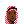
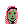

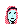

4x
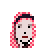
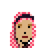
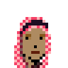
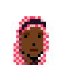
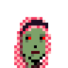
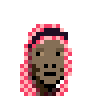
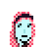


Let's add regular shades :


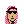
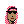
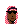
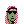
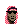
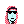

4x
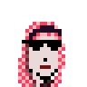
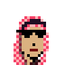

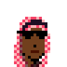
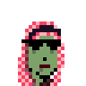
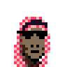
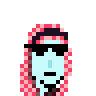


Let's try a special edition with 3d glasses :


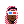


4x
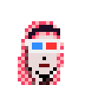
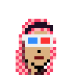


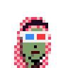
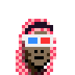
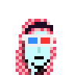


That's it.  Right-click and save to get yourself a free princess.
Super rare arabian night alien princess! Never before seen arabian night zombie princess!

Yes, you can! Now generate your own amazing princesses.


## Questions? Comments?

Post them on the [CryptoPunksDev reddit](https://old.reddit.com/r/CryptoPunksDev). Thanks.

