# Blockheads (Anno 2013) - Let's Build 8x8 Pixel Art Avatars from Scratch


Let's build 8x8 pixel art avatars from scratch
inspired by the Blockheads [Video] Game (Anno 2013)
that featured "randomized" avatars known as - surprise, surprise - blockheads.


Let's use [Blockheads - The Guide to 70 Boy Skins (Anno 2013)](https://forums.theblockheads.net/t/the-guide-to-boy-skins/6964)
to get started.


Let's put together a face (8x8) building block for every of the five skin tones
(lighter, light, medium, dark, darker):


``` ruby
require 'pixelart'

# 8x8 block - 3 colors:
#  @ - color 1 - skin tone,
#  x - color 2 (darker)  - nose + mouth (lower lips)
#  o - color 3 (darkest) - mouth (upper lips)

face_design =<<TXT
@ @ @ @ @ @ @ @
@ @ @ @ @ @ @ @
@ @ @ @ @ @ @ @
@ @ @ @ @ @ @ @
@ @ @ x x @ @ @
@ @ @ @ @ @ @ @
@ @ @ o o @ @ @
@ @ @ x x @ @ @
TXT

skin_tones = {
   lighter: ['F8CEB8', 'E8AF90', 'A06E63'],
   light:   ['E0A98B', 'DA8E63', '955144'],
   medium:  ['D1885F', 'D56E35', '913623'],
   dark:    ['A36140', 'A84D1C', '732412'],
   darker:  ['773D20', '7D2E03', '561202'],
}

skin_tones.each do |key,colors|
   face = Image.parse( face_design, colors: colors )

   face.save( "face_#{key}.png")
   face.zoom(4).save( "face_#{key}4x.png" )
end
```

Resulting in:


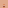
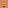

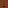

4x

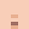


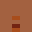


Let's add the building blocks for the two eyes variants (small and large):

``` ruby
BLACK = '000000'
WHITE = 'FFFFFF'

eyes_small = Image.parse( <<TXT, colors: [BLACK, WHITE] )
  x @ . . @ x
TXT

block = Image.new( 8, 8 )
block.compose!( eyes_small, 1, 3 )  ## note: add x-offset +1, y-offset +3
block.save( "eyes_small.png")
block.zoom(4).save( "eyes_small4x.png" )


eyes_large = Image.parse( <<TXT, colors: [BLACK, WHITE] )
  x @ . . @ x
  x @ . . @ x
TXT

block = Image.new( 8, 8 )
block.compose!( eyes_large, 1, 3 )  ## note: add x-offset +1, y-offset +3
block.save( "eyes_large.png")
block.zoom(4).save( "eyes_large4x.png" )
```

Resulting in:

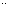
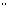

4x

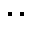


And let's add hair style and colors:


``` ruby
hair_styles = {
  regular: <<TXT,
@ @ @ @ @ @ @ @
@ @ @ @ @ @ @ @
@ . . . . . . @
TXT

  side_burns: <<TXT,
@ @ @ @ @ @ @ @
@ @ @ @ @ @ @ @
@ . . . . . . @
@ . . . . . . @
TXT

  bangs: <<TXT,
@ @ @ @ @ @ @ @
@ . . @ @ @ @ @
@ . . . @ @ @ @
TXT

  crew_cut: <<TXT,
@ @ @ @ @ @ @ @
@ @ @ @ @ @ @ @
. @ @ @ @ @ @ .
TXT
}


hair_colors = {
  black:    BLACK,
  blonde:   'EDC58C',
  brunette: '472516',
  maroon:   '390404',
  ginger:   '91280C',
  red:      'E22626',
  purple:   '710CC7',
}


hair_colors.each do |hair_color_key,hair_color|
  hair_styles.each do |hair_style_key,hair_style_design|

    hair = Image.parse( hair_style_design, colors: [hair_color] )

    block = Image.new( 8, 8 )
    block.compose!( hair )
    block.save( "hair_#{hair_style_key}-#{hair_color_key}.png")
    block.zoom(4).save( "hair_#{hair_style_key}-#{hair_color_key}4x.png" )
  end
end
```

Resulting in:

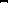


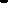
4x


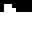


4x


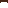
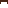
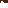
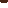
4x


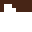


4x


4x


4x


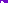

4x


All together now.
Let's try putting together some blockheads:


``` ruby
blockheads = [
  ## face (skin tone), eyes (small|large), hair style (+ color)
  ['darker',  'small',  'regular-blonde' ],
  ['light',   'small',  'bangs-red' ],
  ['medium',  'large',  'side_burns-purple' ],
  ['lighter', 'large',  'crew_cut-maroon' ]
]

blockheads.each_with_index do |attribs, i|
   face = "face_#{attribs[0]}"
   eyes = "eyes_#{attribs[1]}"
   hair = "hair_#{attribs[2]}"

   block = Image.read( "#{face}.png" )
   block.compose!( Image.read( "#{eyes}.png" ))
   block.compose!( Image.read( "#{hair}.png" ))

   block.save( "blockhead#{i}.png")
   block.zoom(4).save( "blockhead#{i}x4.png" )
   block.zoom(8).save( "blockhead#{i}x8.png" )
end
```

Resulting in:

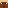
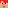
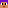
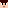

4x


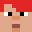

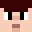

8x


That's it for now. Now generate your own blockheads
and use your own designs.
Bonus for adding the missing beard building blocks / attribues.
Yes, you can!


## Questions? Comments?

Post them on the [CryptoPunksDev reddit](https://old.reddit.com/r/CryptoPunksDev). Thanks.


