# All Caps Experiment - Choose Your Own (Baseball) Cap Color


Here's the experiment - let's (re)draw
the (baseball) cap (from scratch / from zero)
and let's put the cap
with your own colors of choice onto any
zero-attribute "plain vanilla" punk archetype.


Let's use the online punk pixel drawing tool (see => [**cryptopunksnotdead.github.io**](https://cryptopunksnotdead.github.io) )
to draw the (baseball) cap in 14x5 size.


Tip: Use the print button to export the (baseball) cap into
a ready-to-cut-n-paste pixel matrix.


Let's try:

``` ruby
cap_design = <<TXT
. . @ @ @ @ @ @ @ . . . . .
. @ @ @ @ @ @ x @ @ . . . .
@ @ @ @ @ @ @ @ x @ . . . .
@ @ @ @ @ @ @ @ @ @ @ @ @ .
@ @ @ @ @ @ @ @ @ @ @ @ @ @
TXT

cap = Image.parse( cap_design, colors: ['8119b7', 'b261dc'] )
cap.save( 'cap.png' )
cap.zoom(4).save( 'capx4.png' )
```

Resulting in:


Let's put the cap onto the four archetypes
(human, zombie, ape, alien)  with the human in the four
variants (lighter, light, dark, darker)
and let's add four more archetypes
(vampire, orc, skeleton, mummy) for fun.


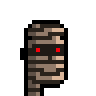


``` ruby
designs = [
  'human-male!lighter',
  'human-male!light',
  'human-male!dark',
  'human-male!darker',
  'zombie-male',
  'ape-male',
  'alien-male',
  'vampire-male',
  'orc-male',
  'skeleton-male',
  'mummy-male',
]


designs.each do |design|
  punk = Punks::Image.new( design: design )

  x, y = [6, 4]                  ## head offset
  punk.compose!( cap, x, y )

  name = design.sub( '!', '_')   ## note: change human-male!lighter to human-male_lighter

  punk.save( "#{name}_279.png" )
  punk.zoom(4).save( "#{name}_279x4.png" )
end
```


Resulting in:


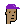
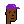
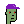
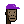


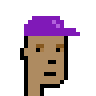

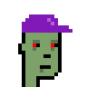
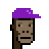


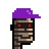


Let's try different colors for the (baseball) cap.
Note the original violet-ish colors are in the
red / green / blue (rgb) and in the hue / saturation / lightness
scheme:

-  51 pixel - #8119b7 / rgb(129  25 183) - hsl(279°  76%  41%)
-   2 pixel - #b261dc / rgb(178  97 220) - hsl(280°  64%  62%)

Let's change the hue 279° from the primary color
and let's keep all other color settings.
Let's try:

- 300°  => magenta
- 330°  => fuchsia
- 0°    => red
- 30°   => orange
- 90°   => chartreuse
- 120°  => green
- 240°  => blue

``` ruby
hues = [279, 300, 330, 0, 30, 90, 120, 240]
hues.each do |hue|
  cap  = Image.parse( cap_design, colors: [[hue,         0.76, 0.41],
                                           [(hue+1)%360, 0.64 ,0.62]] )

  designs.each do |design|
     punk = Punks::Image.new( design: design )

     head_x, head_y = [6, 4]  ## head offset - x/y start positions
     punk.compose!( cap, head_x, head_y )

     name = ''
     name << design.sub( '!', '_')   ## note: change human-male!lighter to human-male_lighter
     name << '_'
     name << '%03d' % hue

     punk.save( "#{name}.png" )
     punk.zoom(4).save( "#{name}x4.png" )
  end
end

```

Voila!


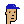


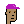
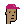


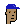


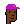
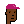


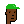
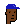


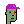
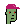
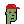


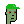
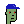


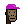


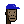


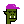


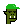


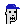


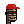

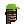
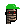
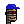


4x


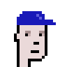


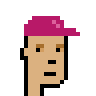


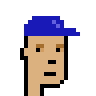


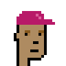

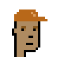


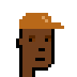
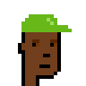

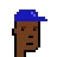


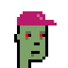
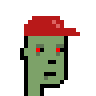
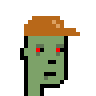


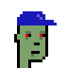


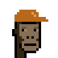


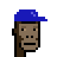


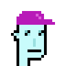
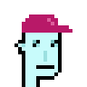
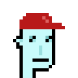
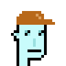
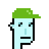


That's it for now.  Now use your own colors
or design your own caps. Yes, you can!


## Questions? Comments?

Post them on the [CryptoPunksDev reddit](https://old.reddit.com/r/CryptoPunksDev). Thanks.
