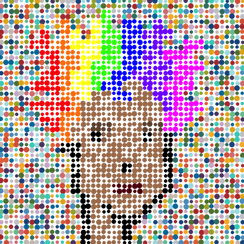
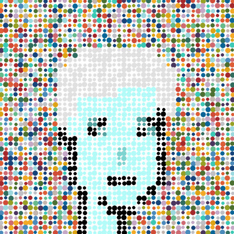
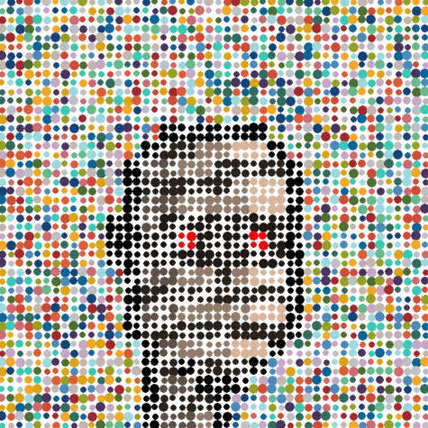
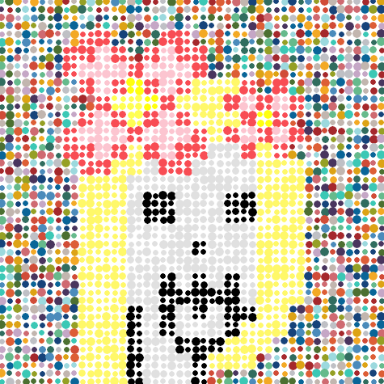
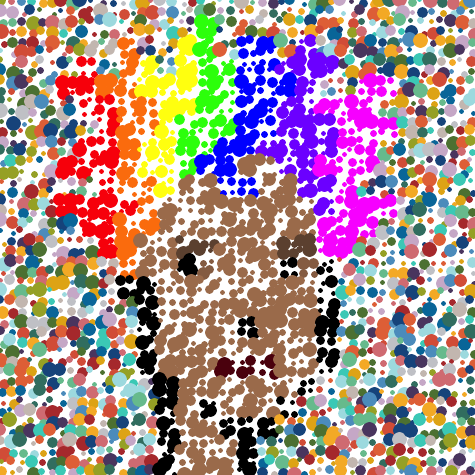
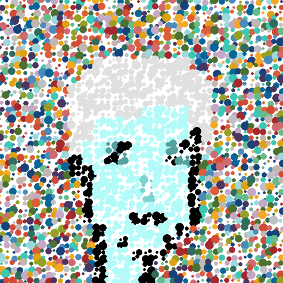
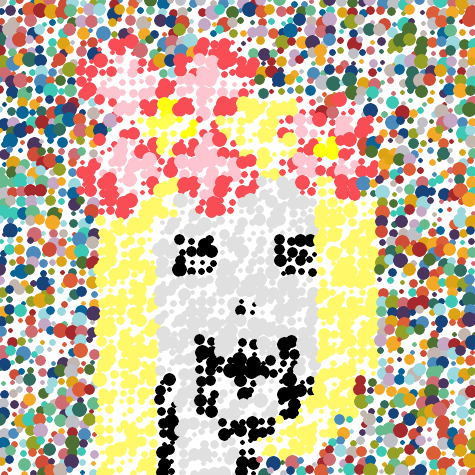

# Punk Art Challenge #1 Experiment -  Dotty Spotty "Currency" Punks Inspired by Damien Hirst's "The Currency"

See
the [**Punk Art Challenge #1**](https://old.reddit.com/r/CryptoPunksDev/comments/pttf4s/punk_art_challenge_1_10_000_dotty_spotty_currency/)
for more background
and [**Part I - Spots Experiment**](../spots) and
[**Part II - Spots Hi-Def Experiment**](../spots-hidef)
in the series here.


Okkie. Welcome back.
Let's try "random" background spots
inspired by Damien Hirst's $40+ million "The Currency"
art collection.

``` ruby
BACKGROUND_SPOTS = [
 # blue-ish
 '49355E', '16437A', '096598', '4B8BBB', '9CD9DE', 'C5A7C6',
 # red-ish
 'A5282C', 'D14C37', 'CF6A71', 'DD5E36', 'DDA315', 'F3A925',
 # green-ish
 '4C7031', '95A025', '66BA8C', '316D5F',
 # gray-ish /white-ish
 'C2B6AF', 'BFC0C5', '3BC8B5',
]
```

Change the currency spot colors to your liking. The background spots
get selected randomly.


Let's give it a try using
the more punks
  #10088,
  #10100,
  #10180 and
  #10190:


Let's try a 2x zoom with quadruple the pixels:

``` ruby
punk.zoom(2).spots( 5, spacing: 5,
                     center: [-1,1], radius: [3,6],
                     background: BACKGROUND_SPOTS )
```







Let's make the spots bigger
with a radius between 2px and 8px
and the offset more random -/+3px:

``` ruby
punk.zoom(2).spots( 5, spacing: 5,
                     center: [-3,3], radius: [2,8],
                     background: BACKGROUND_SPOTS )
```







## Bonus - Free High-Definition (Hi-Def) XXXL Poster-Size Quality Edition

One more thing - let's go high definition (hi-def), yes, XXXL
with poster-size quality thanks to vector graphics.
Let's try:

``` ruby
punk.zoom(2).spots_hidef( 5, spacing: 5,
                     center: [-3,3], radius: [2,8],
                     background: BACKGROUND_SPOTS )
```

High-definition (hi-def) XXXL!? Yes, it's all text in the scalable vector graphics (svg) format. For example, open up [**punk-10088-currency-v2@2x.svg**](https://github.com/cryptopunksnotdead/cryptopunks/raw/master/currency/i/punk-10088-currency-v2@2x.svg) in your browser and zoom in 100%, 200%, 300%, .. and so on and yes, the quality stays hi-definition (hi-def)!


That's it for now to get you started.


## Questions? Comments?

Post them on the [CryptoPunksDev reddit](https://old.reddit.com/r/CryptoPunksDev). Thanks.

