# Geminis Experiment - Super Rare Twin, Triple 'n' Quadruple Punks


Let's start with a trivia quiz:

Q: What's super rarer than an alien?
A: Yes, a gemini (twin) alien!


Here's the experiment - let's draw more than one punk in
the same image.

Let's start with geminis and let's geminify
the punks #0 ,
#2964 ,
#3100 ,
#3393 :


``` ruby
punks = Punks::Image::Composite.read( 'punks.png' )

ids      = [0, 2964, 3100, 3393]
offset_x = 14

ids.each do |id|
  name = "%04d" % id

  punk = punks[id]

  gemini = Image.new( 24+offset_x, 24 )
  gemini.compose!( punk, 0, 0 )
  gemini.compose!( punk, offset_x, 0 )

  gemini.save( "gemini-#{name}.png" )
  gemini.zoom(4).save( "gemini-#{name}x4.png" )
end
```

Voila:

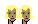

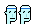


And 4x:

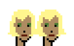
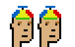

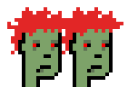


Note: Use the `offset_x` parameter
to get the twins (geminis) closer.
24 is the classic pixel width, thus, by using 14
the twins (geminis) are 10 pixels closer together
(and the second gets "overlayed by 10 pixel on the first one).


Q: What's super rarer than a gemini (twin) alien?
A: Yes, a triple alien!


Let's try never before seen super rare triplets:

``` ruby
ids.each do |id|
  name = "%04d" % id

  punk = punks[id]

  triplet = Image.new( 24+offset_x*2, 24 )
  triplet.compose!( punk, 0, 0 )
  triplet.compose!( punk, offset_x, 0 )
  triplet.compose!( punk, offset_x*2, 0 )

  triplet.save( "triplet-#{name}.png" )
  triplet.zoom(4).save( "triplet-#{name}x4.png" )
end
```


Voila:

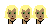
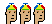
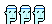
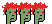

And 4x:

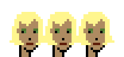
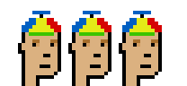
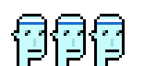
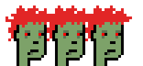


Q: What's super rarer than a triple or quadruple alien?
A: Yes, a sextuplet alien!


Let's try sextuplets and let's flip
the last three punks horizontally (that is, looking left not right):

``` ruby
ids.each do |id|
  name = "%04d" % id

  punk = punks[id]

  sextuplet = Image.new( 24+offset_x*5, 24 )
  sextuplet.compose!( punk, 0, 0 )
  sextuplet.compose!( punk, offset_x, 0 )
  sextuplet.compose!( punk, offset_x*2, 0 )
  ## flip horizonatally (mirror) the next three
  sextuplet.compose!( punk.mirror, offset_x*3, 0 )
  sextuplet.compose!( punk.mirror, offset_x*4, 0 )
  sextuplet.compose!( punk.mirror, offset_x*5, 0 )

  sextuplet.save( "sextuplet-#{name}.png" )
  sextuplet.zoom(4).save( "sextuplet-#{name}x4.png" )
end
```


Voila:


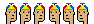
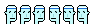


And 4x:

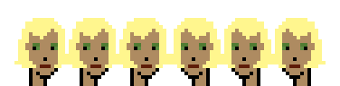


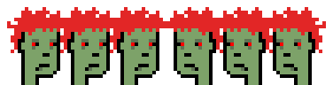


That's it for now.  Now use your own punks
and generate new before seen super rare twins, triplets,
quadruplets, quintuplets or sextuplets. Yes, you can!


## Questions? Comments?

Post them on the [CryptoPunksDev reddit](https://old.reddit.com/r/CryptoPunksDev). Thanks.
