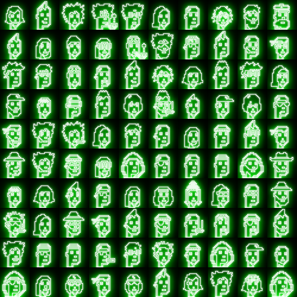
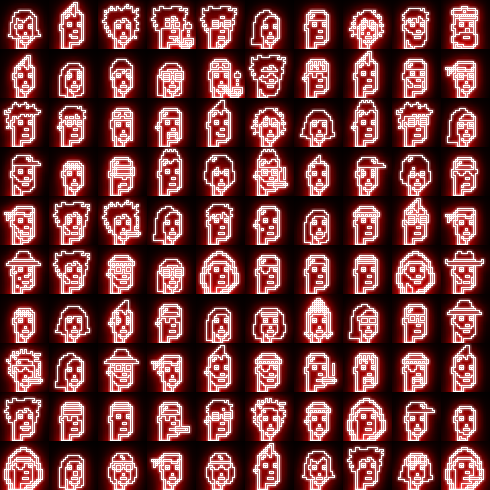
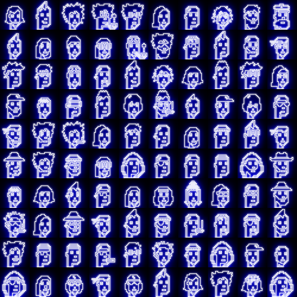

# Neon Light Glow Effect Experiment

Let's try a neon light glow effect
inspired by
[How to Create Neon Text With CSS](https://css-tricks.com/how-to-create-neon-text-with-css/).

Let's try different neon light colors
on the first one hundred punks.

Green

Red

Blue

That's it for now.

## Questions? Comments?

Post them on the [CryptoPunksDev reddit](https://old.reddit.com/r/CryptoPunksDev). Thanks.

