# Rastafaris Experiment - Cool Rasta Punks with Shades

Here's the experiment - let's use a rastafari hair building block 
and let's turn zero-attribute "plain vanilla" punk archetypes
into cool looking rastas with shades.


Let's add the new hair building block  to the four archetypes - 
human (with the four variants, that is, lighter, light, dark, darker)


,
 zombie , 
 ape , 
 alien  - 
and let's add four more archetypes - 
demon , 
vampire , 
orc , 
skeleton  -  
for more fun.


``` ruby
hair = Image.read( 'rastafari-hair.png' )

designs = [
  'human-male!lighter',
  'human-male!light',
  'human-male!dark',
  'human-male!darker',
  'zombie-male',
  'ape-male',
  'alien-male',
  'demon-male',
  'vampire-male',
  'orc-male',
  'skeleton-male',
]


designs.each do |design|
  punk = Punks::Image.new( design: design )

  punk.compose!( hair )

  name = design.sub( '!', '_')   ## note: change human-male!lighter to human-male_lighter

  punk.save( "rastafari-#{name}.png" )
  punk.zoom(4).save( "rastafari-#{name}x4.png" )
end
```


Resulting in:


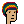
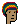
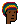
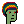
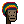

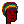
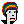
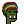
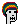

4x
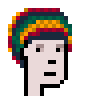
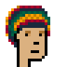
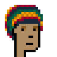
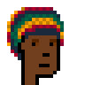
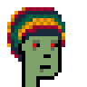


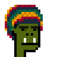
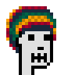


Let's add regular shades :

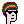
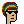
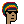
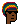
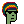
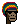


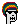

4x
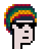

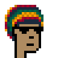
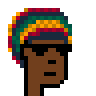
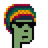

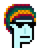
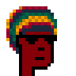
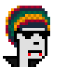
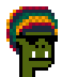
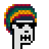


Let's add a pipe 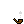:


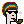
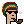
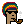
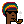
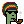
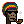
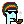
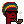
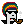


4x

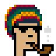
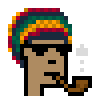
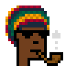
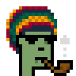
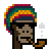
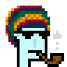
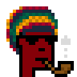
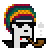


Let's try a special edition with 3d glasses :


4x


That's it.  Right-click and save to get yourself a free rastafari.
Super rare rastafari alien! Never before seen rastafari demon!

Yes, you can! Now generate your own cool rastas.


## Questions? Comments?

Post them on the [CryptoPunksDev reddit](https://old.reddit.com/r/CryptoPunksDev). Thanks.
