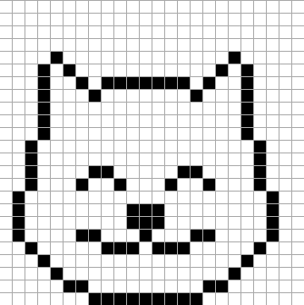
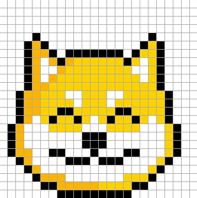
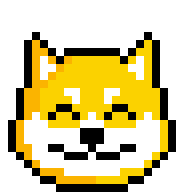
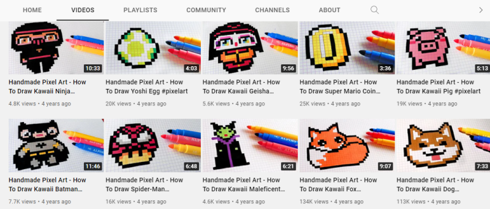
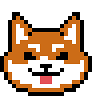
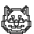
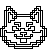
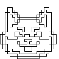

# How to Draw Shiba Inu or Kawaii Dog - Handmade (24x24) Pixel Art


Let's watch the
the [How to Draw Shiba Inu - Handmade Pixel Art
video (6:20)](https://www.youtube.com/c/Pixelo/videos) from the Pixel Art series by Pixelo.

Yes, you can.
Let's follow along and let's draw a handmade shiba inu on a computer 24x24 canvas
by hand (that is, by mouse clicking to draw pixels).


Start with the all black (one color) outline:




If you use the [Punk Pixel Drawing Tool](https://cryptopunksnotdead.github.io/), click on the "↓ Print" button to get the
pixel matrix in the "ascii" text format.
Let's cut-n-paste into the pixel art drawing script:


``` ruby
require 'pixelart'


## pre-define some (standard) colors (in rgb hex)
BLACK = '000000'
WHITE = 'FFFFFF'


design =<<TXT     # 24x24 pixels (1 color - black outline) - stage 1
. . . . . . . . . . . . . . . . . . . . . . . .
. . . . . . . . . . . . . . . . . . . . . . . .
. . . . . . . . . . . . . . . . . . . . . . . .
. . . . . . . . . . . . . . . . . . . . . . . .
. . . . @ . . . . . . . . . . . . . @ . . . . .
. . . @ . @ . . . . . . . . . . . @ . @ . . . .
. . . @ . . @ . @ @ @ @ @ @ @ . @ . . @ . . . .
. . . @ . . . @ . . . . . . . @ . . . @ . . . .
. . . @ . . . . . . . . . . . . . . . @ . . . .
. . . @ . . . . . . . . . . . . . . . @ . . . .
. . . @ . . . . . . . . . . . . . . . @ . . . .
. . @ . . . . . . . . . . . . . . . . . @ . . .
. . @ . . . . . . . . . . . . . . . . . @ . . .
. . @ . . . . @ @ . . . . . @ @ . . . . @ . . .
. . @ . . . @ . . @ . . . @ . . @ . . . @ . . .
. @ . . . . . . . . . . . . . . . . . . . @ . .
. @ . . . . . . . . @ @ @ . . . . . . . . @ . .
. @ . . . . . . . . @ @ @ . . . . . . . . @ . .
. @ . . . . @ @ . . . @ . . . @ @ . . . . @ . .
. . @ . . . . . @ @ @ . @ @ @ . . . . . @ . . .
. . . @ . . . . . . . . . . . . . . . @ . . . .
. . . . @ . . . . . . . . . . . . . @ . . . . .
. . . . . @ @ . . . . . . . . . @ @ . . . . . .
. . . . . . . @ @ @ @ @ @ @ @ @ . . . . . . . .
TXT


shibainu = Image.parse( design, colors: [BLACK] )
shibainu.save( "shibainu_outline.png" )
shibainu.zoom(8).save( "shibainu_outline8x.png" )
```

Voila!


8x 


Let's add colors.
If you use the [Punk Pixel Drawing Tool](https://cryptopunksnotdead.github.io/),
change color 1, 2, 3 & 4 to `000000` (black), `FBB400`, `FBD200`, `FFFFFFF` (white)
and - click, click, click, click, click, click, click, click [...] -
the pixel matrix canvas to:




Again if you use the [Punk Pixel Drawing Tool](https://cryptopunksnotdead.github.io/) click on the "↓ Print" button to get the
pixel matrix in the "ascii" text format.
Let's again cut-n-paste into the pixel art drawing script:

``` ruby
design =<<TXT     # 24x24 pixels (4 colors - black, base 1, base 2, white)
. . . . . . . . . . . . . . . . . . . . . . . .
. . . . . . . . . . . . . . . . . . . . . . . .
. . . . . . . . . . . . . . . . . . . . . . . .
. . . . . . . . . . . . . . . . . . . . . . . .
. . . . @ . . . . . . . . . . . . . @ . . . . .
. . . @ x @ . . . . . . . . . . . @ o @ . . . .
. . . @ x x @ . @ @ @ @ @ @ @ . @ o o @ . . . .
. . . @ x ^ x @ x o o o o o o @ o ^ o @ . . . .
. . . @ x ^ ^ x o o o o o o o o ^ ^ o @ . . . .
. . . @ x ^ x o o o o o o o o o o ^ o @ . . . .
. . . @ x x o o o o o o o o o o o o o @ . . . .
. . @ x x o o o ^ ^ o o o ^ ^ o o o o o @ . . .
. . @ x x o o o o ^ o o o ^ o o o o o o @ . . .
. . @ x x o o @ @ o o o o o @ @ o o o o @ . . .
. . @ x ^ o @ o o @ o ^ o @ o o @ o ^ o @ . . .
. @ x ^ ^ ^ o o o o ^ ^ ^ o o o o ^ ^ ^ o @ . .
. @ x ^ ^ ^ ^ ^ ^ ^ @ @ @ ^ ^ ^ ^ ^ ^ ^ o @ . .
. @ x ^ ^ ^ ^ ^ ^ ^ @ @ @ ^ ^ ^ ^ ^ ^ ^ o @ . .
. @ x x ^ ^ @ @ ^ ^ ^ @ ^ ^ ^ @ @ ^ ^ ^ o @ . .
. . @ x ^ ^ ^ ^ @ @ @ ^ @ @ @ ^ ^ ^ ^ o @ . . .
. . . @ x ^ ^ ^ ^ ^ ^ ^ ^ ^ ^ ^ ^ ^ o @ . . . .
. . . . @ x x x ^ ^ ^ ^ ^ ^ ^ o o o @ . . . . .
. . . . . @ @ x x x x x o o o o @ @ . . . . . .
. . . . . . . @ @ @ @ @ @ @ @ @ . . . . . . . .
TXT


shibainu = Image.parse( design, colors: [BLACK, 'FBB400', 'FBD200', WHITE] )
shibainu.save( "shibainu.png" )
shibainu.zoom(8).save( "shibainu8x.png" )
```

Voila!


8x 


## Day 2 



Let's watch the
[How To Draw Kawaii Dog - Handmade Pixel Art
video (7:32)](https://www.youtube.com/c/HelloPixelArt/videos) from the Hello Pixel Art series by Garbi Kw.

Yes, you can.
Let's again follow along and let's draw a handmade kawaii dog on a computer 24x24 canvas
by hand (that is, by mouse clicking to draw pixels).


If you use the [Punk Pixel Drawing Tool](https://cryptopunksnotdead.github.io/), click on the "↓ Print" button to get the
pixel matrix in the "ascii" text format.
Let's cut-n-paste into the pixel art drawing script:


``` ruby
design =<<TXT     # 24x24 pixels  (1 color - black outline) - stage 1
. . . . . . . . . . . . . . . . . . . . . . . .
. . . . . . . . . . . . . . . . . . . . . . . .
. . . . . . . . . . . . . . . . . . . . . . . .
. . . @ @ . . . . . . . . . . . . . @ @ . . . .
. . . @ . @ . . . . . . . . . . . @ . @ . . . .
. . @ . . . @ . . . . . . . . . @ . . . @ . . .
. . @ . . . . @ . . . . . . . @ . . . . @ . . .
. . @ . . . . . @ @ @ @ @ @ @ . . . . . @ . . .
. . @ . . . . @ . . . . . . . @ . . . . @ . . .
. . @ . . . . . . . . . . . . . . . . . @ . . .
. . @ . . . . . . . . . . . . . . . . . @ . . .
. . @ . . . . . . . . . . . . . . . . . @ . . .
. . @ . . . . . . . . . . . . . . . . . @ . . .
. @ . . . . @ @ . . . . . . . @ @ . . . . @ . .
@ . . . . . @ @ @ . . . . . @ @ @ . . . . . @ .
@ . . . . . . . . . . . . . . . . . . . . . @ .
@ . . . . . . . . . @ @ @ . . . . . . . . . @ .
@ . . . . . . @ . . . @ . . . @ . . . . . . @ .
. @ . . . . . . @ @ @ @ @ @ @ . . . . . . @ . .
. @ . . . . . . . . . . . . . . . . . . . @ . .
. . @ . . . . . . . . . . . . . . . . . @ . . .
. . . @ . . . . . . . . . . . . . . @ @ . . . .
. . . . @ @ @ . . . . . . . . . @ @ @ . . . . .
. . . . . . . @ @ @ @ @ @ @ @ @ . . . . . . . .
TXT

kawaiidog = Image.parse( design, colors: [BLACK] )
kawaiidog.save( "i/kawaiidog_outline.png" )
kawaiidog.zoom(8).save( "i/kawaiidog_outline8x.png" )


design =<<TXT     # 24x24 pixels
. . . . . . . . . . . . . . . . . . . . . . . .
. . . . . . . . . . . . . . . . . . . . . . . .
. . . . . . . . . . . . . . . . . . . . . . . .
. . . @ @ . . . . . . . . . . . . . @ @ . . . .
. . . @ x @ . . . . . . . . . . . @ x @ . . . .
. . @ x x x @ . . . . . . . . . @ x x x @ . . .
. . @ x ^ x x @ . . . . . . . @ x x ^ x @ . . .
. . @ x ^ ^ x x @ @ @ @ @ @ @ x x ^ ^ x @ . . .
. . @ x ^ ^ x @ x x x x x x x @ x ^ ^ x @ . . .
. . @ x ^ ^ ^ x x x x x x x x x ^ ^ ^ x @ . . .
. . @ x ^ x x x x x x x x x x x x x ^ x @ . . .
. . @ x x x x ^ ^ ^ x x x ^ ^ ^ x x x x @ . . .
. . @ x x x x x x ^ x x x ^ x x x x x x @ . . .
. @ x x x x @ @ x x x x x x x @ @ x x x x @ . .
@ x x x x x @ @ @ x ^ ^ x x @ @ @ x x x x x @ .
@ x ^ x x x x ^ ^ ^ ^ ^ ^ ^ ^ ^ x x x x ^ x @ .
@ x ^ ^ ^ ^ ^ ^ ^ ^ @ @ @ ^ ^ ^ ^ ^ ^ ^ ^ x @ .
@ x ^ ^ ^ ^ ^ @ ^ ^ ^ @ ^ ^ ^ @ ^ ^ ^ ^ ^ x @ .
. @ x ^ ^ ^ ^ ^ @ @ @ @ @ @ @ ^ ^ ^ ^ ^ x @ . .
. @ x ^ ^ ^ ^ ^ ^ ^ o o o ^ ^ ^ ^ ^ ^ ^ x @ . .
. . @ x x ^ ^ ^ ^ ^ o o o ^ ^ ^ ^ ^ x x @ . . .
. . . @ x x x x ^ ^ ^ ^ ^ ^ ^ x x x @ @ . . . .
. . . . @ @ @ x x x x x x x x x @ @ @ . . . . .
. . . . . . . @ @ @ @ @ @ @ @ @ . . . . . . . .
TXT


kawaiidog = Image.parse( design, colors: [BLACK, 'CC6C17', 'E45157', WHITE] )
kawaiidog.save( "i/kawaiidog.png" )
kawaiidog.zoom(8).save( "i/kawaiidog8x.png" )
```

Voila!


8x 


8x 


Bonus:  Let's try Image#sketch to "automagically" generate a pencil drawing sketch

``` ruby
shibainu.sketch( 1 ).save( 'shibainu_sketch.png' )
shibainu.sketch( 4 ).save( 'shibainu_sketch4x.png' )
shibainu.sketch( 8, line: 2 ).save( 'shibainu_sketch8x2.png' )

kawaiidog.sketch( 1 ).save( 'kawaiidog_sketch.png' )
kawaiidog.sketch( 4 ).save( 'kawaiidog_sketch4x.png' )
kawaiidog.sketch( 8, line: 2 ).save( 'kawaiidog_sketch8x2.png' )
```


Voila!


4x 
8x 


4x 
8x 


## Questions? Comments?

Post them on the [CryptoPunksDev reddit](https://old.reddit.com/r/CryptoPunksDev). Thanks.

