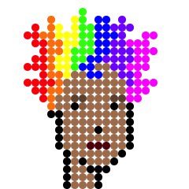
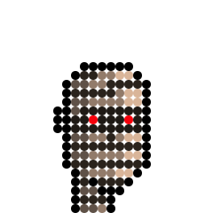
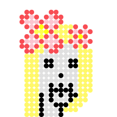
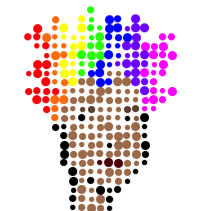
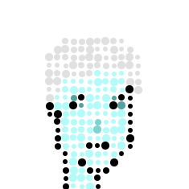
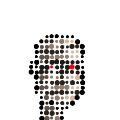
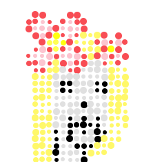
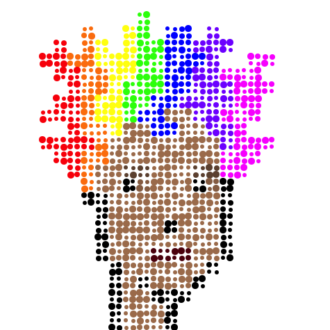
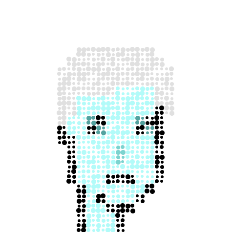
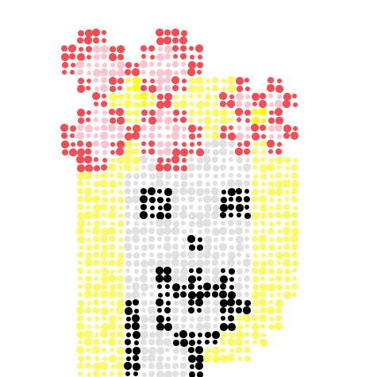

# Punk Art Challenge #1 Experiment -  Dotty Spotty "Currency" Punks Inspired by Damien Hirst's "The Currency" - The High-Definition (Hi-Def) XXXL Edition


See
the [**Punk Art Challenge #1**](https://old.reddit.com/r/CryptoPunksDev/comments/pttf4s/punk_art_challenge_1_10_000_dotty_spotty_currency/)
for more background.


Okkie. Welcome back.
Let's try a high-definition (hi-def) XXXL edition.


Let's give it a try using
the more punks
  #10088,
  #10100,
  #10180 and
  #10190.


Let's start with 10px circles -
resulting in a 24*10px = 240×240px format:


``` ruby
punk.spots( 10 )
```








240×240px!? High-definition (hi-def) XXXL!?


Yes, it's poster-size vector graphics quality!
Let's look at the [**punk-10088_spots1.svg**](i/punk-10088_spots1.svg) image source:

``` svg
<circle cx="35" cy="45" r="5" fill="#f6000bff" />
<circle cx="35" cy="85" r="5" fill="#f6000bff" />
<circle cx="35" cy="105" r="5" fill="#f6000bff" />
<circle cx="45" cy="35" r="5" fill="#f6000bff" />
<circle cx="45" cy="45" r="5" fill="#f6000bff" />
<circle cx="45" cy="55" r="5" fill="#f6000bff" />
...
```

Yes, it's all text in the scalable vector graphics (svg) format.
Open up [**punk-10088_spots1.svg**](https://github.com/cryptopunksnotdead/cryptopunks/raw/master/spots-hidef/i/punk-10088_spots1.svg) in your browser and zoom in 100%, 200%, 300%, .. and so on and yes, the
quality stays hi-definition (hi-def)!


Let's add 1/1 spacing
and let's try a random circle radius
between 3px and 6px:

``` ruby
punk.spots( 5, spacing: 5,
                center: [-1,1], radius: [3,6] )
```







Let's try a 2x zoom with quadruple the pixels:

``` ruby
punk.zoom(2).spots( 5, spacing: 5,
                     center: [-1,1], radius: [3,6] )
```







That's it for now to get you started.


## Questions? Comments?

Post them on the [CryptoPunksDev reddit](https://old.reddit.com/r/CryptoPunksDev). Thanks.

