# Punk Art Challenge #1 Experiment -  Dotty Spotty "Currency" Punks Inspired by Damien Hirst's "The Currency"


The [**Punk Art Challenge #1**](https://old.reddit.com/r/CryptoPunksDev/comments/pttf4s/punk_art_challenge_1_10_000_dotty_spotty_currency/) reads:


How does it work?
Let's pick a theme and then it's up to you - yes, you can - to put together a new punk collection
with your own artistic interpretation / generation script.

Let's kick off with a theme inspired by
 [Damien Hirst's "The Currency"](https://currency.nft.heni.com/) token art parody
or is that cash grab with a paper with a bunch of random circles starting at $2000 a piece?

> The original sale of the artworks worked like an initial public offering of shares.
> Aspiring buyers could register and say how many they wanted
> (but not nominate which individual work).
> The offering was over-subscribed, as more than 30,000 people wanted
> more than 60,000 tokens (that is, three time the available number).
>
> [...]
>
> The sale of all 10,000 works is worth $20 million.
> But over the past month, since the artworks went on sale,
> there have been more than 1,800 resales, for almost $40 million.
> The highest price paid so far is $120,000, for No. 6272, titled “Yes”.
>
> Source: [Damien Hirst’s dotty ‘currency’ art makes as much sense as Bitcoin](https://theconversation.com/damien-hirsts-dotty-currency-art-makes-as-much-sense-as-bitcoin-166958)

   Let's generate 10 000 free dotty spotty punks.
   For example - turn every colored pixel in the 24x24 bitmap into a circle and
   maybe use different-sized variants of circles and maybe
  use a random offset "distortion" for the circle placement and maybe use some blur or a texture and so on.


---

Okkie.
Let's give it a try using
the punks
alien  #3100,
zombie  #3393,
blondie  #172 and
beanie  #2964.


Let's start with 10px circles -
resulting in a 24*10px = 240×240px format:


``` ruby
punk.spots( 10 )
```


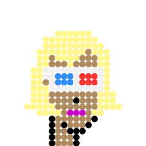


Let's add spacing about ½ between circles -
resulting in a 24\*7px circles + (24-1)\*3px spacing = 237×237px format:

``` ruby
punk.spots( 7, spacing: 3 )
```


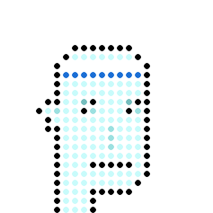
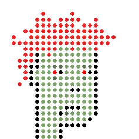


Let's try a 1/1 spacing between circles -
resulting in a 24\*5px circles + (24-1)\*5px spacing = 235×235px format:

``` ruby
punk.spots( 5, spacing: 5 )
```


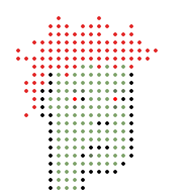
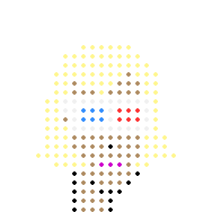
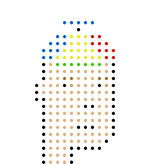


Let's add some randomness. Let's try a random circle radius
between 3px and 5px
and a random x/y-offset from the circles center by +/-2px:

``` ruby
punk.spots( 10, center: [-2,2], radius: [3,5] )
```

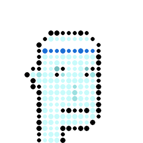
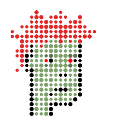
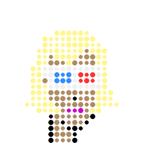
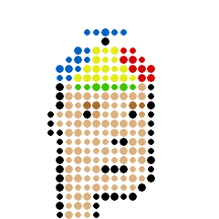


Let's add back the 1/1 spacing
and let's try a random circle radius
between 5px and 10px:

``` ruby
punk.spots( 5, spacing: 5,
                center: [-2,2], radius: [2,5] )
```

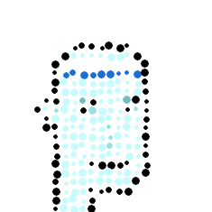
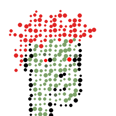
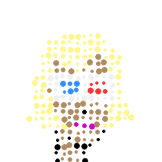
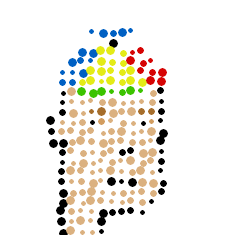


And bigger between 3px and 6px:


``` ruby
punk.spots( 5, spacing: 5,
                center: [-1,1], radius: [3,6] )
```


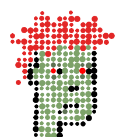

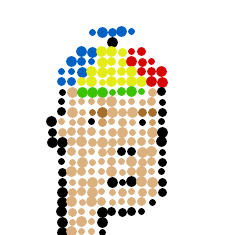


Let's try a random variation (+/-) of the lightness of the colored pixels:

``` ruby
punk.spots( 5, spacing: 5,
                center: [-1,1], radius: [3,6],
                lightness: [-0.03,0.03] )
```

.png)
.png)
.png)
.png)


And let's try an offset variation for odd and even lines:

``` ruby
punk.spots( 5, spacing: 5,
                center: [-1,1], radius: [3,6],
                lightness: [-0.03,0.03],
                odd: true )
```

.png)
.png)
.png)
.png)


Let's start all over again and let's bring back the background:

``` ruby
punk.spots( 10, background: '#638596' )
```

.png)
.png)
.png)
.png)

``` ruby
punk.spots( 7, spacing: 3,
               background: '#638596' )
```

.png)
.png)
.png)
.png)

``` ruby
punk.spots( 5, spacing: 5,
               background: '#638596' )
```

.png)
.png)
.png)
.png)


``` ruby
punk.spots( 10, center: [-2,2], radius: [3,5],
                background: '#638596' )
```

.png)
.png)
.png)
.png)


``` ruby
punk.spots( 5, spacing: 5,
                center: [-2,2], radius: [2,5],
                background: '#638596' )
```

.png)
.png)
.png)
.png)


``` ruby
punk.spots( 5, spacing: 5,
                center: [-1,1], radius: [3,6],
                background: '#638596' )
```

.png)
.png)
.png)
.png)


``` ruby
punk.spots( 5, spacing: 5,
                center: [-1,1], radius: [3,6],
                lightness: [-0.03,0.03],
                background: '#638596' )
```

.png)
.png)
.png)
.png)


``` ruby
punk.spots( 5, spacing: 5,
                center: [-1,1], radius: [3,6],
                lightness: [-0.03,0.03],
                odd: true,
                background: '#638596' )
```

.png)
.png)
.png)
.png)


One more thing - lets a 2x zoom with quadruple (2×2=4) the pixel.

``` ruby
punk.zoom( 2 ).spots( 10 )
```

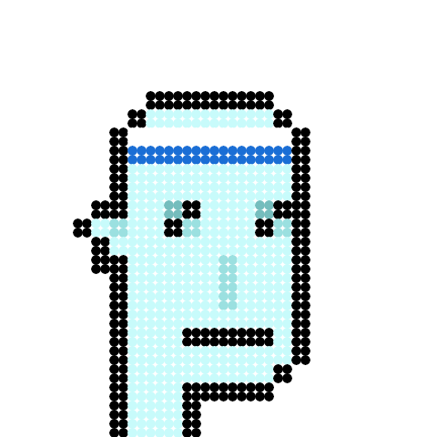


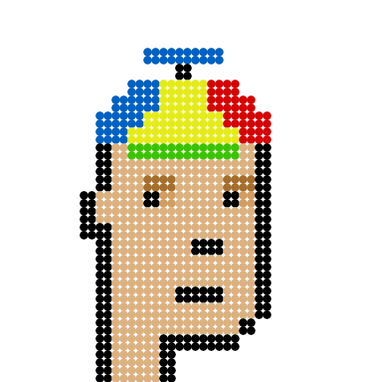


``` ruby
punk.zoom( 2 ).spots( 10, center: [-2,2], radius: [3,5] )
```

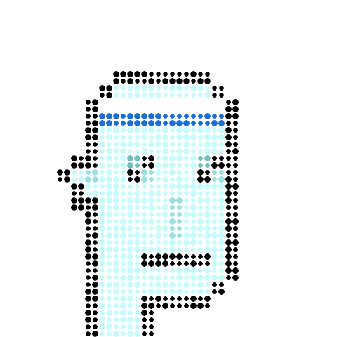
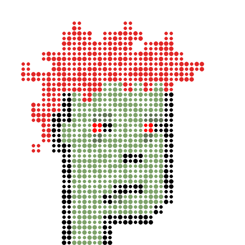
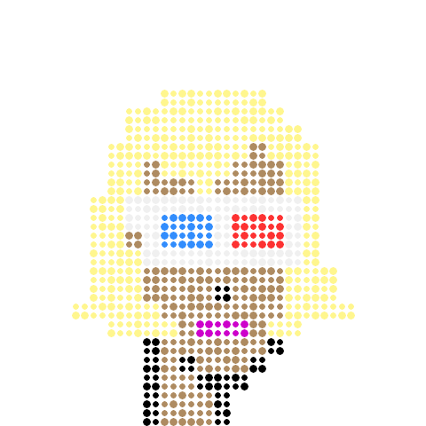
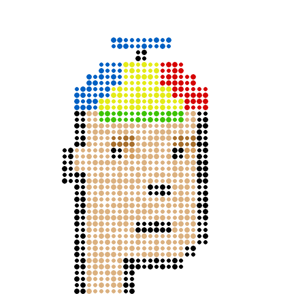


``` ruby
punk.zoom( 2 ).spots( 5, spacing: 5,
                          center: [-2,2], radius: [2,5] )
```


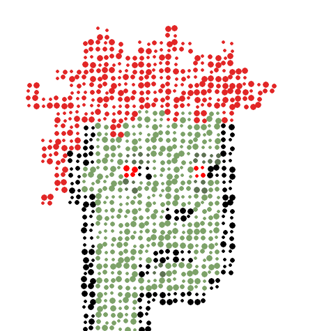
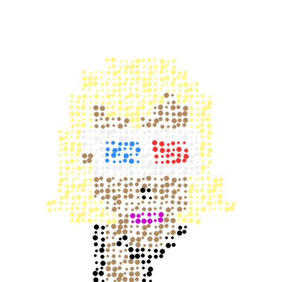


``` ruby
punk.zoom( 2 ).spots( 5, spacing: 5,
                          center: [-1,1], radius: [3,6] )
```

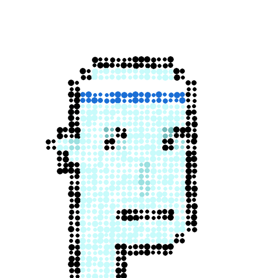
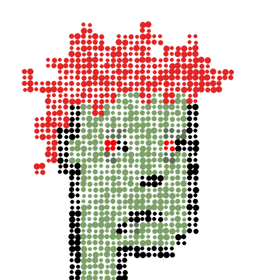
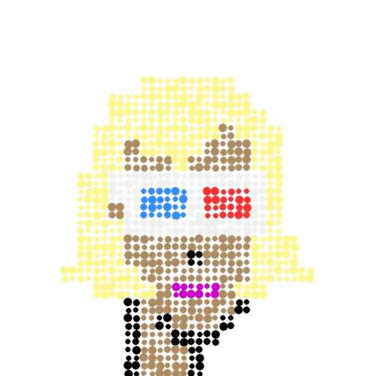


That's it for now to get you started.


## Questions? Comments?

Post them on the [CryptoPunksDev reddit](https://old.reddit.com/r/CryptoPunksDev). Thanks.


