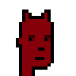
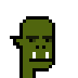
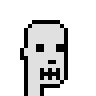
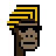
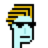
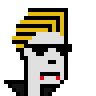
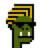

# Wall Street Bets Experiment - Power to the Punks - Draw Your Own Wall Street Bets Degenerate (from Scratch)


Mint Yourself Free Punks in the "Degenerate" Wall Street Bets Style


Here's the experiment - let's draw a hair-do and sun glasses (from scratch / from zero)
and let's turn zero-attribute "plain vanilla" punk archetypes
into cool looking wall street bets degen traders with shades.


Let's use the online punk pixel drawing tool (see => [**cryptopunksnotdead.github.io**](https://cryptopunksnotdead.github.io) )
to draw a wall street bets hair-do.


Tip: Use the print button to export the hair-do into
a ready-to-cut-n-paste pixel matrix.

Let's try:

``` ruby
hair = Image.parse( <<TXT, colors: ['000000', 'E8BC0D'] )
. . . . @ @ @ @ @ @ @ @ @ @
. . . . x x x x x x x x x @
. . . @ @ @ @ @ @ @ @ @ x @
. . x x x x x x x x x @ x @
. @ @ @ @ @ @ @ @ @ x @ x @
. x x x x x x x x @ x @ x @
. @ @ @ @ @ . . . . . . x @
x x x x x . . . . . . . . .
@ @ @ @ . . . . . . . . . .
. x x . . . . . . . . . . .
. @ @ . . . . . . . . . . .
TXT

hair.save( 'hair.png' )
hair.zoom(4).save( 'hair@4x.png' )
```

Resulting in:


And let's design the shades:


``` ruby
shades = Image.parse( <<TXT, colors: ['000000'] )
@ @ @ @ @ @ @ @ @ @ @ @
. . @ @ @ @ . . @ @ @ @
. . . @ @ . . . . @ @ .
TXT

shades.save( 'shades.png' )
shades.zoom(4).save( 'shades@4x.png' )
```

Resulting in:


Let's add the new hair-do and shades to the four archetypes
(human, zombie, ape, alien)  with the human in the four
variants (4/3/2/1 - lighter, light, dark, darker)
and let's add four more archetypes
(demon, vampire, orc, skeleton) for fun.








``` ruby
names = [
  'human-male_4',   ## formerly skin tone lighter
  'human-male_3',   ##   - " -   light
  'human-male_2',   ##   - " -   dark
  'human-male_1',   ##   - " -   darker
  'zombie-male',
  'ape-male',
  'alien-male',
  'demon-male',
  'vampire-male',
  'orc-male',
  'skeleton-male',
]


names.each do |name|
  punk = Punks::Sheet.find_by( name: name )

  punk.compose!( hair,   3, 2  )  ## hair offset (x:3,y:2)
  punk.compose!( shades, 6, 11 )  ## shades offset (x:6,y:11)

  punk.save( "wallstreetbets-#{name}.png" )
  punk.zoom(4).save( "wallstreetbets-#{name}@4x.png" )
end
```


Resulting in:









That's it.  Right-click and save to get yourself a free degen.
Super rare degen alien! Never before seen degen demon!

Yes, you can! Now design your own hair-do and/or sunglasses.


## Questions? Comments?

Post them on the [CryptoPunksDev reddit](https://old.reddit.com/r/CryptoPunksDev). Thanks.
