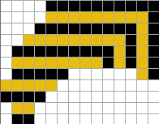
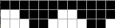
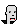
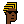
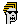
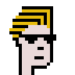
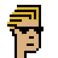
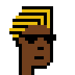
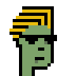
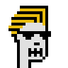

# Wall Street Bets Experiment - Power to the Punks - Draw Your Own Wall Street Bets Degenerate (from Scratch)


Mint Yourself Free Punks in the "Degenerate" Wall Street Bets Style


Here's the experiment - let's draw a hair-do and sun glasses (from scratch / from zero)
and let's turn zero-attribute "plain vanilla" punk archetypes
into cool looking wall street bets degen traders with shades.


Let's use the online punk pixel drawing tool (see => [**cryptopunksnotdead.github.io**](https://cryptopunksnotdead.github.io) )
to draw a wall street bets hair-do.




Tip: Use the print button to export the hair-do into
a ready-to-cut-n-paste pixel matrix.

Let's try:

``` ruby
hair = Image.parse( <<TXT, colors: ['000000', 'E8BC0D'] )
. . . . @ @ @ @ @ @ @ @ @ @
. . . . x x x x x x x x x @
. . . @ @ @ @ @ @ @ @ @ x @
. . x x x x x x x x x @ x @
. @ @ @ @ @ @ @ @ @ x @ x @
. x x x x x x x x @ x @ x @
. @ @ @ @ @ . . . . . . x @
x x x x x . . . . . . . . .
@ @ @ @ . . . . . . . . . .
. x x . . . . . . . . . . .
. @ @ . . . . . . . . . . .
TXT

hair.save( 'hair.png' )
hair.zoom(4).save( 'hairx4.png' )
```

Resulting in:


And let's design the shades:




``` ruby
shades = Image.parse( <<TXT, colors: ['000000'] )
@ @ @ @ @ @ @ @ @ @ @ @
. . @ @ @ @ . . @ @ @ @
. . . @ @ . . . . @ @ .
TXT

shades.save( 'shades.png' )
shades.zoom(4).save( 'shadesx4.png' )
```

Resulting in:


Let's add the new hair-do and shades to the four archetypes
(human, zombie, ape, alien)  with the human in the four
variants (lighter, light, dark, darker)
and let's add four more archetypes
(demon, vampire, orc, skeleton) for fun.





``` ruby
designs = [
  'human-male!lighter',
  'human-male!light',
  'human-male!dark',
  'human-male!darker',
  'zombie-male',
  'ape-male',
  'alien-male',
  'demon-male',
  'vampire-male',
  'orc-male',
  'skeleton-male',
]


designs.each do |design|
  punk = Punks::Image.new( design: design )

  punk.compose!( hair,   3, 2  )  ## hair offset (x:3,y:2)
  punk.compose!( shades, 6, 11 )  ## shades offset (x:6,y:11)

  name = design.sub( '!', '_')   ## note: change human-male!lighter to human-male_lighter

  punk.save( "wallstreetbets-#{name}.png" )
  punk.zoom(4).save( "wallstreetbets-#{name}x4.png" )
end
```


Resulting in:

















That's it.  Right-click and save to get yourself a free degen.
Super rare degen alien! Never before seen degen demon!

Yes, you can! Now design your own hair-do and/or sunglasses.


## Questions? Comments?

Post them on the [CryptoPunksDev reddit](https://old.reddit.com/r/CryptoPunksDev). Thanks.
