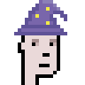
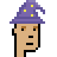
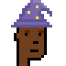
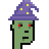
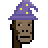

# Wizard -  Attribute of the Day  -  Punk w/ Wizard Hat


Let's get inspired by
[Legion Punks on Solana](https://legionpunks.com)
and let's design a wizard hat from scratch:


``` ruby
wizard = Image.parse( <<TXT, colors: ['5F5297', '7966AB', '8B80B7', 'F1EA49'] )
 . . . . . . . x o o o . . . .
 . . . . . . @ x x x x o . . .
 . . . . . @ @ x x ^ x x o . .
 . . . . @ @ x x x x x @ @ @ .
 . . . . @ x ^ x x x @ . . @ @
 . . . @ @ x x x x x @ @ . . @
 . . . @ x x x x x ^ x @ . . .
 . . @ @ @ @ @ @ @ @ @ @ @ . .
 . @ x x x x x x x x x x x @ .
 @ @ @ @ @ @ @ @ @ @ @ @ @ @ @
TXT

wizard.save( 'wizard.png' )
wizard.zoom(4).save( 'wizard4x.png' )
```

Voila!

 4x 


And let's try the wizard hat 
on the punk archetypes


:


``` ruby
designs = [
  'human-male!lighter',
  'human-male!light',
  'human-male!dark',
  'human-male!darker',
  'zombie-male',
  'ape-male',
  'alien-male',
 ]

designs.each do |design|
  punk = Punks::Image.new( design: design )

  punk.compose!( wizard, 4, 0 )

  name = design.sub( '!', '_')   ## note: change human-male!lighter to human-male_lighter

  punk.save( "punk_wizard-#{name}.png" )
  punk.zoom(4).save( "punk_wizard-#{name}x4.png" )
end
```


Voila!


4x








That's it.  Now design and try your own attributes.
Yes, you can!


## Questions? Comments?

Post them on the [CryptoPunksDev reddit](https://old.reddit.com/r/CryptoPunksDev). Thanks.

